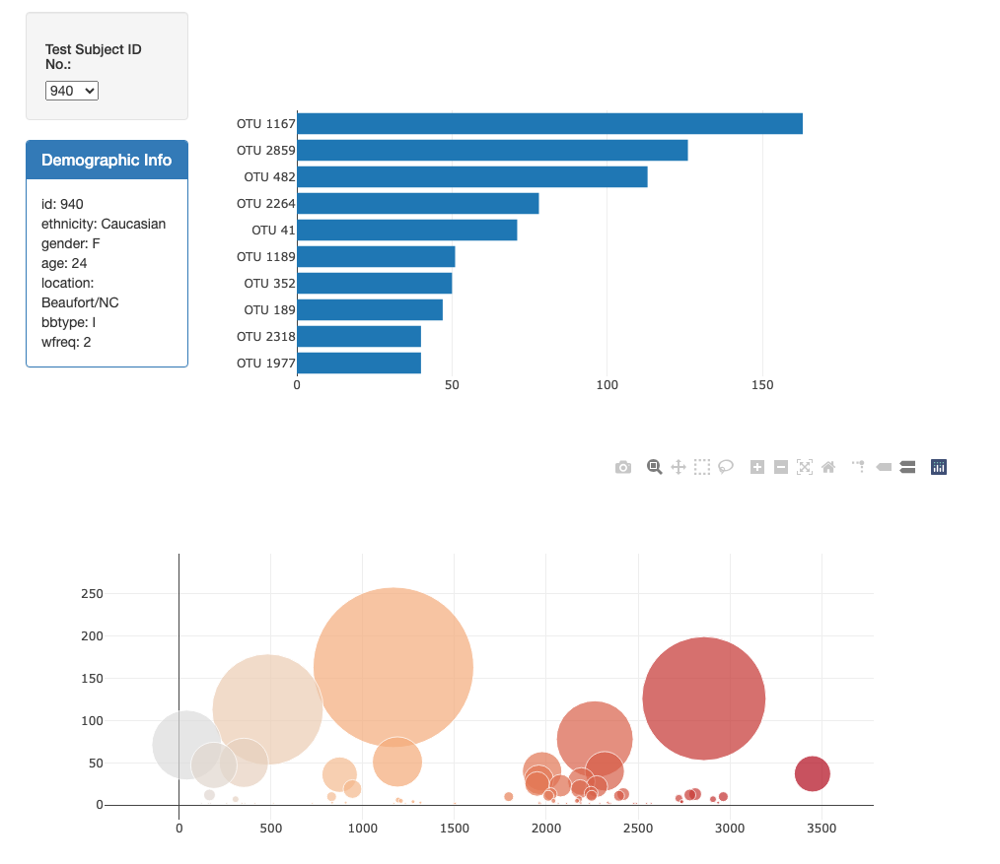

# belly-button-challenge
## Table of Contents

- [Instructions](#instructions)
- [Contents of the Repository](#repository_contents)
- [Questions and Answers](#questions)
- [Givens](#givens)

## Instructions
In this assignment, you will build an interactive dashboard to explore the Belly Button Biodiversity datasetLinks to an external site., which catalogs the microbes that colonize human navels. 
The dataset reveals that a small handful of microbial species (also called operational taxonomic units, or OTUs, in the study) were present in more than 70% of people, while the rest were relatively rare.

## Repository_Contents
There are 2 coding deliverables. The first is static/app.js which contains the javascript code for the challenge. It contains all of the manipulation and visualization of the dataset The second is index.html which was mainly given to us though I made a few changes to better fit my code specifically. 

## Questions
There were no big questions asked in this challenge. The data is displayed at this site: https://rywheliss96.github.io/belly-button-challenge/  
Below you will find a sample view of the data  

## Givens
Most of my process was very straight forward. I completed all of the working testing along the way. 
All code was generated by myself. 
    
Data for this dataset and instructions were generated by edX Boot Camps LLC, and is intended for educational purposes only.
